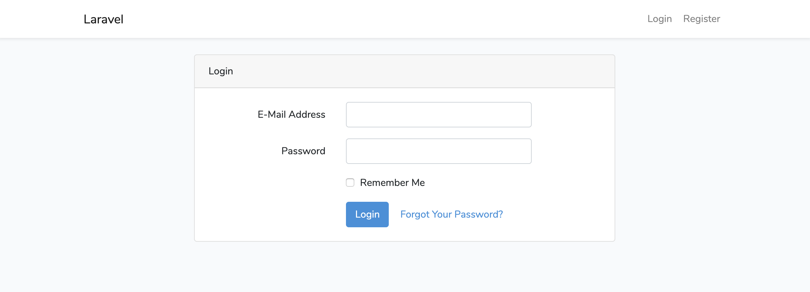

# laravel60-authentication



```
$ git clone git@github.com:ucan-lab/laravel60-authentication
$ cd laravel60-authentication
$ docker-compose up -d --build
$ docker-compose exec app composer install
$ docker-compose exec app cp .env.example .env
$ docker-compose exec app php artisan key:generate
$ docker-compose exec app php artisan migrate
$ docker-compose run app node npm install
$ docker-compose run app node npm run dev
```
